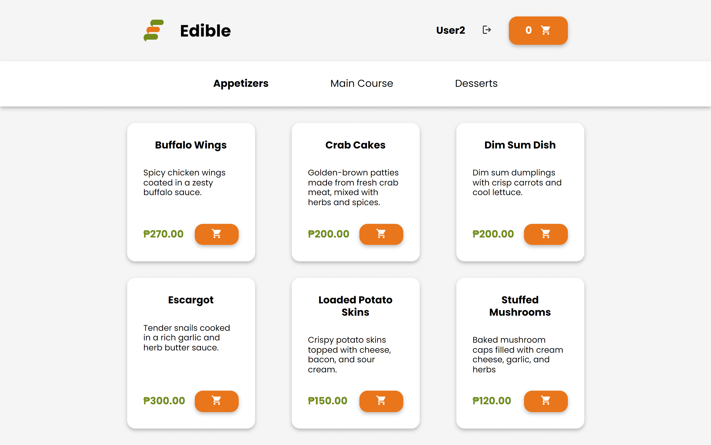

# Restaurant Web App using PHP

This is a restaurant web application created for a fictional company named "Edible". Its made as a way for me to learn about the fundamentals of PHP. 

Menu items and users are fetched and displayed from the database. Users can order food as a guest. They can also register an account and earn a 10% discount for it. Users can log in and logout anytime. 

## How to run the restaurant web app:

1. Download and install XAMPP.
2. Create a folder in `C:/xampp/htdocs` and name it restaurant-php
3. Clone this repository to the folder `C:/xampp/htdocs/restaurant-php`.
4. Run Apache and MySQL from the XAMPP control panel.
5. Locate the `restaurant.sql` file in the database folder.
6. Open `http://localhost/phpmyadmin/`, create a database named restaurant, and import the `restaurant.sql` file to it.
7. Open `http://localhost/restaurant-php/` to run the website.

## Technologies Used

| **Category**                | **Technology**          |
|-----------------------------|-------------------------|
| Frontend Languages          | HTML, CSS, JavaScript   |
| Backend Languages           | PHP                     |
| Backend Tools               | XAMPP                   |
| IDE                         | Visual Studio Code      |
| Design Tool                 | Figma                   |
| Documentation Tool          | MkDocs                  |
| Documentation Hosting       | ReadtheDocs             |

## User Interface

### Home

### Menu

### Login

## Attributions

<a href="https://www.freepik.com/free-photo/dim-sum_1123462.htm#query=food%20transparent&position=25&from_view=keyword&track=ais_user&uuid=b0d9d9ee-f0d8-4305-be2e-3d1101b4d92b" target="_blank" rel="noopener noreferrer">Dimsum Dish image</a> by mrsiraphol on Freepik

<a href="https://www.freepik.com/free-photo/mixed-sashimi-set_3521483.htm#from_view=detail_alsolike" target="_blank" rel="noopener noreferrer">Mixed Sashimi Set image</a> by lifeforstock on Freepik

<a href="https://www.freepik.com/free-photo/roasted-grilled-beef-liver-with-onion-tomatoes-salad_6932571.htm#fromView=search&page=1&position=29&uuid=e8e04e4a-10e0-426e-b67d-66dcf8afbb39" target="_blank" rel="noopener noreferrer">Beef Salad image</a> by timolina on Freepik

<a href="https://www.pexels.com/photo/close-up-photo-of-dinnerware-set-on-top-of-table-with-glass-cups-1395967/" target="_blank" rel="noopener noreferrer">Restaurant image</a> by Mat Brown on Pexels

<a href="https://www.figma.com/community/file/1159710650809705970/placeholder-company-logos-ui-kit-untitled-ui" target="_blank" rel="noopener noreferrer">Placeholder Company Icon</a> by Untitled UI on Figma Community

Icons from <a href="https://iconify.design/" target="_blank" rel="noopener noreferrer">iconify.design</a> 
