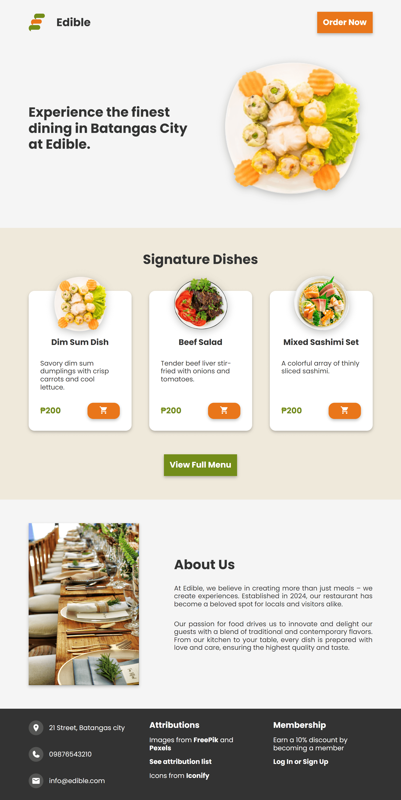
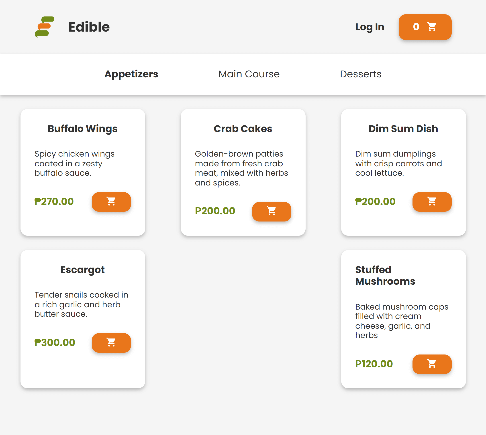
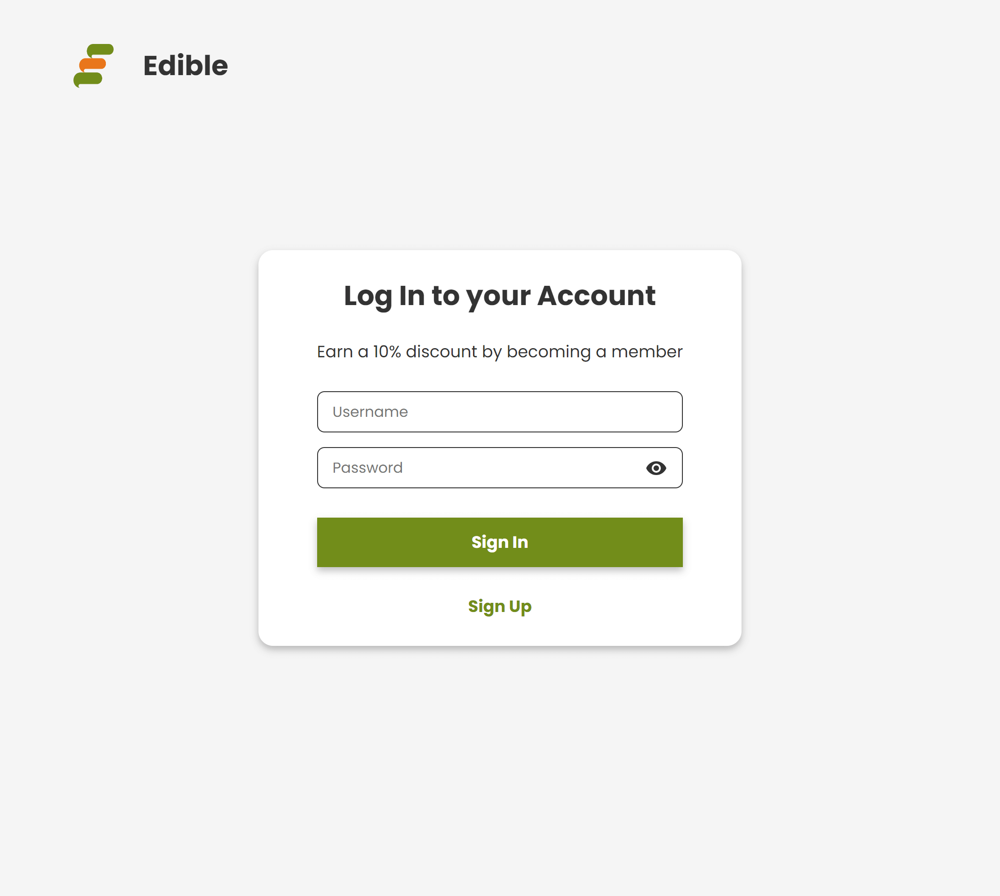

# Restaurant Web App using PHP

This is a web-based restaurant application created for a fictional company named "Edible". 

## How to run the restaurant web app:

1. Download and install XAMPP.
2. Clone this repository to the folder `C:/xampp/htdocs`.
3. Run Apache and MySQL from the XAMPP control panel.
4. Locate the `restaurant.sql` file in the database folder.
5. Open `http://localhost/phpmyadmin/` and import the `restaurant.sql` file.
6. Open `http://localhost/restaurant-php/` to run the website.

## Functions

1. User Registration
2. Menu and Users are displayed from the database
3. Login functionality
4. Session handling

## User Interface

### Home

### Menu

### Login

## Attributions

- **Dimsum Dish**: Image by [mrsiraphol](https://www.freepik.com/free-photo/dim-sum_1123462.htm#query=food%20transparent&position=25&from_view=keyword&track=ais_user&uuid=b0d9d9ee-f0d8-4305-be2e-3d1101b4d92b) on Freepik

- **Mixed Sashimi Set**: Image by [lifeforstock](https://www.freepik.com/free-photo/mixed-sashimi-set_3521483.htm#from_view=detail_alsolike) on Freepik

- **Beef Salad**: Image by [timolina](https://www.freepik.com/free-photo/roasted-grilled-beef-liver-with-onion-tomatoes-salad_6932571.htm#fromView=search&page=1&position=29&uuid=e8e04e4a-10e0-426e-b67d-66dcf8afbb39) on Freepik

- **Restaurant**: Image by [Mat Brown](https://www.pexels.com/photo/close-up-photo-of-dinnerware-set-on-top-of-table-with-glass-cups-1395967/) on Pexels

- **Placeholder Company Logo**: Logo by [Untitled UI](https://www.figma.com/community/file/1159710650809705970/placeholder-company-logos-ui-kit-untitled-ui) on Figma Community