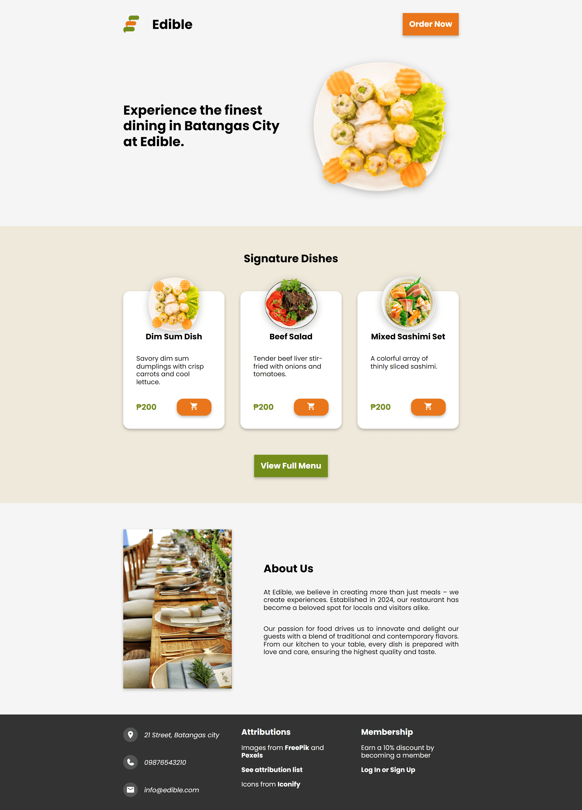
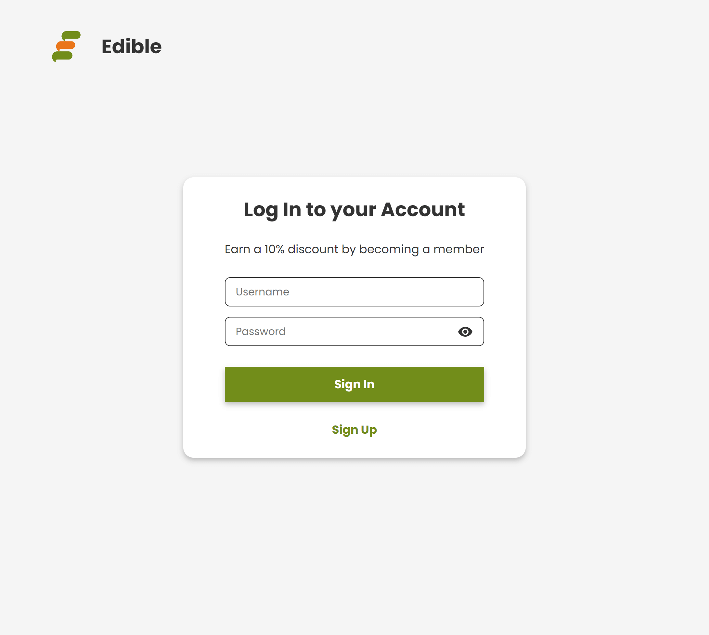

# Design

Design is a crucial aspect of any web project, it determines how well the viewers can navigate and maintain interest in the content. 

When designing a restaurant website, I focused on balancing aesthetic with functionality, ensuring that visitors can easily navigate the menu, create orders, and explore what the restaurant has to offer. I aimed to create a design that keeps visitors engaged and encourage them to explore every aspect of the website. The goal was to create a visually pleasing experience without overwhelming the viewer. Every component has a purpose, and unnecessary details were avoided.

This section explains designs that had reasons behind it.

## Color Pallete

| **Color**       | **Hex** | **Preview**                                                                                       |
|-----------------|---------|---------------------------------------------------------------------------------------------------|
| White           | #FFF    | 

 |
| Whitesmoke      | #f5f5f5 | 

 |
| Dark Charcoal   | #333    | 

 |
| Vivid Tangelo   | #E9761B | 

 |
| Olive Drab (#3) | #728D1A | 

 |

White and Black are used in most websites as a necessary part of pallettes. Dark Charcoal is used rather than Black and Whitesmoke instead of White to provide a softer and more comfortable reading experience.

White however, is used in texts rather than Whitesmoke for better readability.

I used Vivid Tangelo as the primary color and Olive Drab (#3) as the secondary color because it is a good color combination.

## Placeholder Company

**Name**

For the name, since its just fictional, I chose to just use common words. I thought that it should be something that is related with restaurants so I got the idea of naming the company "*Edible*".  

**Icon**

| **Original Icon from Untitled UI**                  | **Final Icon**                                   |
|-----------------------------------------------------|--------------------------------------------------|
|  |   |

After settling with the name, I browsed [Untitled UI](https://www.figma.com/community/file/1159710650809705970/placeholder-company-logos-ui-kit-untitled-ui) for free placeholder logos that would fit the name and I found this logo that looks like the letter "*E*" and also looks like sauces that came out of a squeeze bottle so I chose it because it fits perfectly.

I also changed its color with the primary and secondary color for it to fit the web application design.

## Typography

| **Category** | **Details**            |
|--------------|------------------------|
| Font Family  | Poppins, sans-serif    |               |
| Font Sizes   | 36px, 30px, 22px, 16px |

Poppins was chosen for its clean and modern look, with Sans-Serif as the fallback.

To maintain a simple design, I limited the font sizes to the default size and three additional sizes.

## Home Page Layout

**Background**

The Whitesmoke background is used for simplicity and to not strain the eyes of the user.

**Sections**

It is important for websites sections to be visually distinct from each other to separate ideas so I used different background colors to divide each sections. Vertical padding is applied to each section to enhance readability. 

**Content Width**

I chose a content width of 1000px to ensure optimal readability on larger screens. By keeping the content width narrower, it prevents the text from spanning too wide, making it easier for viewers to read and follow along without straining their eyes.  It also makes it easier to translate the design to mobile devices.

**Balance**

Each content is spread to the edge of the content containers and the contents are aligned and spaced evenly giving it a visually pleasing balance. 

**Links**

Links are set to open in new tabs to prevent users from losing interest or needing to reload the restaurant site. 

### Banner Section

Restaurants commonly displays their most popular dish at the banner so I placed the top view of a dish there.

### Signature Dishes Section

Displaying the signature dishes of a company partnered with high quality images can attract potential costumers. 

### About Us Section

Narrating the restaurant helps to connect with costumers and help them understand understand what makes the restaurant unique. 

It is also a good practice to include images or any visua element in each section to keep the viewer engaged.

### Footer 

A simple black background spanning to the ends of the screen is simple but visually appealing enough. 

Less important and slightly unrelated contents from the main content like attributions and additional info should be placed at the footer.

## Menu Page Layout

## Login Page Layout

**Log In**

**Sign Up**

